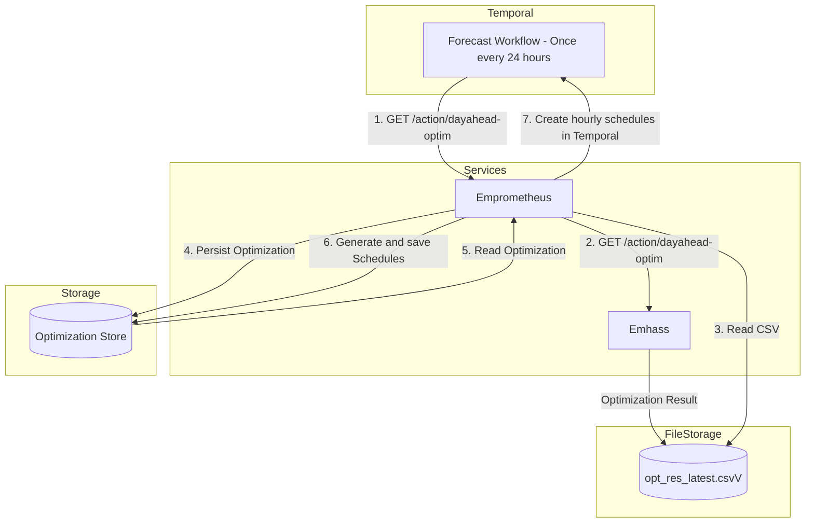
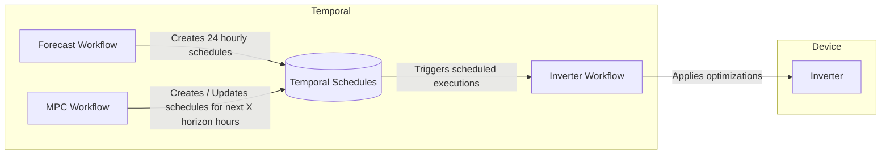

# EmPrometheus
Running emhass against prometheus

## Goal
Be able to run [emhass by davidusb-geek](https://github.com/davidusb-geek/emhass) without home-assistant instead using prometheus data

## docker-compose
```bash
docker compose -f docker-compose.yaml up -d
```
or 
```makefile
make compose
```

## flags
```go
var (
    dir               = flag.String("dir", "./emhass_config/data", "the directory to serve files from")
    tariff            = flag.Bool("tariff", false, "generate tariff files")
    process           = flag.Bool("process", false, "process emhasses")
    server            = flag.Bool("server", false, "run data server")
    promApi           = flag.String("prometheus", "http://192.168.1.112:9090", "http://promapi:port")
    promUser          = flag.String("prometheus.user", "", "http://promapi:port")
    promPass          = flag.String("prometheus.pass", "", "http://promapi:port")
    octopusProduct    = flag.String("octopus.product", "COSY-FIX-12M-25-09-24", "Octopus Product")
    octopusTariff     = flag.String("octopus.tariff", "E-1R-COSY-FIX-12M-25-09-24-N", "Octopus Tariff")
    useTemporal       = flag.Bool("temporal.enable", false, "use temporal")
    temporalNamespace = flag.String("temporal.namespace", "beau", "temporal namespace")
    temporalAddress   = flag.String("temporal.address", "temporal-frontend-headless.temporal.svc.cluster.local:7233", "temporal address")
    temporalSchedule  = flag.String("temporal.schedule", "2 11,23 * * *", "temporal schedule")
    soc = flag.String("soc", "battery_soc", "the prometheus battery SOC metric")
)
```

## Trigger a forecast
This will fascade a call to emhass and save the output
```bash
curl http://localhost:8123/action/dayahead-optim
curl -X POST \
  http://localhost:8123/process \
  -H 'forecast-method: dayahead-optim' 
```

```bash
curl http://localhost:8123/action/naive-mpc-optim
curl -X POST \
  http://localhost:8123/process \
  -H 'forecast-method: naive-mpc-optim' 
```

## Temporal
workflow is work in progress but the existing logic is as below

### Workflows


### Notes
Currently the tariff generated in the CSV is for Octopus using this is optional.