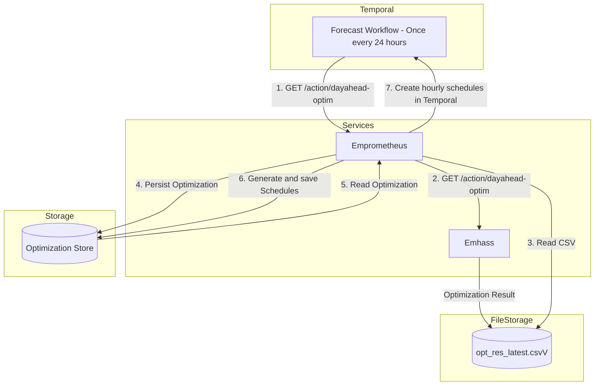
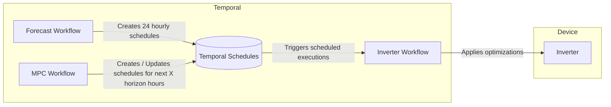

# EmPrometheus
Running emhass against prometheus

## Goal
Be able to run [emhass by davidusb-geek](https://github.com/davidusb-geek/emhass) without home-assistant instead using prometheus data

## docker-compose
```bash
docker compose -f docker-compose.yaml up -d
```
or 
```makefile
make compose
```

## flags

EmPrometheus is configured using command-line flags. Flags use Go's standard `flag` package and can be passed to the application at startup.

| Flag                  | Type   | Default                                                      | Description                                                                                                |
| --------------------- | ------ | ------------------------------------------------------------ | ---------------------------------------------------------------------------------------------------------- |
| `-dir`                | string | `./emhass_config/data`                                       | Directory to serve files from and store application data.                                                  |
| `-tariff`             | bool   | `false`                                                      | Generate electricity tariff files.                                                                         |
| `-process`            | bool   | `false`                                                      | Process EMHASS data, then exit.                                                                            |
| `-server`             | bool   | `false`                                                      | Run the data server.                                                                                       |
| `-source`             | string | `prometheus`                                                 | History provider for energy usage. Supported values: `prometheus`, `solarassistant`.                       |
| `-source.host`        | string | `http://192.168.1.216:9090`                                  | History provider URL, such as the Prometheus API endpoint or Solar Assistant endpoint.                     |
| `-source.user`        | string | Empty                                                        | Basic authentication username for the history provider.                                                    |
| `-source.pass`        | string | Empty                                                        | Basic authentication password for the history provider.                                                    |
| `-octopus.product`    | string | `COSY-22-12-08`                                              | Octopus Energy product identifier.                                                                         |
| `-octopus.tariff`     | string | `E-1R-COSY-22-12-08-N`                                       | Octopus Energy tariff identifier.                                                                          |
| `-temporal.enable`    | bool   | `false`                                                      | Enable Temporal integration.                                                                               |
| `-temporal.namespace` | string | `beau`                                                       | Temporal namespace.                                                                                        |
| `-temporal.address`   | string | `temporal-frontend-headless.temporal.svc.cluster.local:7233` | Temporal frontend address.                                                                                 |
| `-temporal.schedule`  | string | `2 11,23 * * *`                                              | Schedule expression used by Temporal.                                                                      |
| `-temporal.tls`       | bool   | `false`                                                      | Enable TLS for the Temporal client connection.                                                             |
| `-emhass.url`         | string | `http://localhost:5000/action`                               | EMHASS action endpoint.                                                                                    |
| `-mpc`                | bool   | `false`                                                      | Enable model predictive control (MPC) instead of relying only on forecasts.                                |
| `-init`               | bool   | `true`                                                       | Create Temporal schedules when the application starts.                                                     |
| `-dsn`                | string | Empty                                                        | PostgreSQL connection DSN. When provided, PostgreSQL is used to store schedules instead of the file store. |
| `-password`           | string | Empty                                                        | Password for the administrative endpoint.                                                                  |
| `-timezone`           | string | `Europe/London`                                              | Time zone used for scheduling and time calculations.                                                       |
| `-steps`              | int    | `24`                                                         | Number of steps to generate.                                                                               |


## Trigger a forecast
This will fascade a call to emhass and save the output
```bash
curl http://localhost:8123/action/dayahead-optim
curl -X POST \
  http://localhost:8123/process \
  -H 'forecast-method: dayahead-optim' 
```

```bash
curl http://localhost:8123/action/naive-mpc-optim
curl -X POST \
  http://localhost:8123/process \
  -H 'forecast-method: naive-mpc-optim' 
```

## Temporal
workflow is work in progress but the existing logic is as below

```mermaid
flowchart TD
    subgraph Temporal
        A2["Forecast Workflow - Once every 24 hours"]
    end

    subgraph Services
        B2["Emprometheus"]
        C2["Emhass"]
    end

    subgraph Storage
        D2[("Optimization Store")]
    end

    subgraph FileStorage
        F2[("opt_res_latest.csvV")]
    end


    A2 -->|1. GET /action/dayahead-optim| B2
    B2 -->|2. GET /action/dayahead-optim| C2
    C2 -->|Optimization Result| F2
    B2 -->|3. Read CSV| F2
    B2 -->|4. Persist Optimization| D2
    D2 -->|5. Read Optimization| B2
    B2 -->|6. Generate and save Schedules| D2
    B2 -->|7. Create hourly schedules in Temporal| A2
```
### Workflows

```mermaid
flowchart LR

    subgraph Temporal
        FW["Forecast Workflow"]
        MPC["MPC Workflow"]
        IW["Inverter Workflow"]
        TS[("Temporal Schedules")]
    end

    subgraph Device
        INV["Inverter"]
    end

    FW -->|Creates 24 hourly schedules| TS
    MPC -->|Creates / Updates schedules for next X horizon hours| TS
    TS -->|Triggers scheduled executions| IW
    IW -->|Applies optimizations| INV
```

### Notes
Currently the tariff generated in the CSV is for Octopus using this is optional.